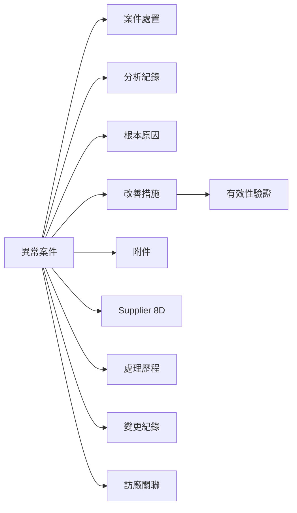

# 異常事件資料模型升級導入計畫

Plan status: completed — 全部階段完成（Phase 0–5 + UI 接入 + 寫入流程補齊 + 原生 Qt visual baseline）

## Goal

將 `anomalies` 從單一扁平紀錄升級為可追蹤的「案件工作區」資料模型，涵蓋：

- 案件生命週期與處置追蹤
- 異常分析紀錄與根本原因
- 改善措施與有效性驗證
- 附件分類、Supplier 8D 版本與變更紀錄
- 查詢、匯出、統計與快照對齊

設計目標：依 `docs/SQE_Incident_Management_UI_Design_Framework_v0.1.md` 第 4–6 章的「案件優先」資料模型，讓使用者能回答「現在要做什麼、誰負責、什麼時候到期、是否有效」。

## Key Architectural Decisions

1. **資料責任矩陣維持不變**  
   `anomalies`、`visits`、`visit_defect_notes` 為 supplier-event 管理；`defect_records` 為倉庫不合格品管理；兩條資料線不得互相寫入。

2. **以子表形式擴展，不破壞既有欄位**  
   新增 `anomaly_actions`、`anomaly_analysis_notes`、`anomaly_root_causes`、`corrective_actions`、`effectiveness_verifications`、`anomaly_attachments`、`anomaly_eight_d_reviews`、`anomaly_audit_logs`；`anomalies` 既有欄位保留作為相容讀取，新寫入逐步改寫子表。

3. **條件式推導才回填，無法推導保留 NULL**  
   既有 `improvement_desc`／`pending_items` 等欄位在新模型中是歷史快照，不自動改寫為已完成狀態；有效性只能由明確驗證紀錄寫入。

4. **每階段獨立 migration 與 `migration_meta`**  
   階段 0–5 各自擁有獨立 meta key，rollback 不互相影響；任何 mid-migration 失敗必須 all-or-nothing 還原。

5. **服務層為唯一權威讀取入口**  
   UI、匯出、統計、Markdown 快照都從 service-layer read model 取資料，禁止自行拼接資料表。

6. **Phase 0 僅盤點，不改動程式碼**  
   本階段所有產物為文件：欄位字典、現況 ERD、資料品質報告、導入計畫、風險與回滾方案。

## 現況資料模型盤點（Phase 0 基線）

### 實體與欄位（`src/database/repository.py`）

#### `anomalies`（單一扁平結構）

| 欄位 | 型別 | 說明 |
| --- | --- | --- |
| id | TEXT PK | UUID |
| anomaly_no | TEXT UNIQUE NOT NULL | 11 碼，YYYYMMDDNNN |
| anomaly_date | TEXT NOT NULL | ISO date |
| supplier_id | TEXT NOT NULL FK | suppliers.id |
| visit_id | TEXT FK | visits.id（nullable） |
| product_id | TEXT FK | products.id（nullable） |
| problem_desc | TEXT NOT NULL | 不良現象描述 |
| category | TEXT DEFAULT '' | 異常類別 |
| product_lot_no | TEXT DEFAULT '' | 批號 |
| product_name | TEXT DEFAULT '' | 料件名稱冗餘 |
| product_stage | TEXT DEFAULT '量產' | 試產/量產 |
| outsource_work_order | TEXT DEFAULT '' | 委外工單 |
| batch_qty | INTEGER DEFAULT 0 | 數量 |
| status | TEXT CHECK IN ('待處理','已結案') | 案件狀態 |
| improvement_desc | TEXT DEFAULT '' | 結案改善內容 |
| closed_by | TEXT DEFAULT '' | 結案驗證人 |
| closed_at | TEXT | 結案日期 |
| pending_items | TEXT DEFAULT '' | 待追蹤內容 |
| responsible_person | TEXT DEFAULT '' | 責任人 |
| due_date | TEXT DEFAULT '' | 預計回覆日 |
| quality_report_required | INTEGER CHECK 0/1 NULL | 品質異常單要求 |
| rc_supplier_inventory | TEXT DEFAULT 'unconfirmed' | 風險控管調查 |
| rc_supplier_wip | TEXT DEFAULT 'unconfirmed' | 風險控管調查 |
| rc_in_transit | TEXT DEFAULT 'unconfirmed' | 風險控管調查 |
| rc_internal_inventory | TEXT DEFAULT 'unconfirmed' | 風險控管調查 |
| is_tech_transfer | INTEGER DEFAULT 0 | 技轉訪廠 |
| created_at / updated_at | TEXT | 系統時間 |

相應服務：

- `src/services/event/_anomaly_service.py:create_anomaly`、`create_anomaly_with_visit_link`、`update_anomaly`、`update_anomaly_link`、`close_anomaly`、`update_anomaly_closed_at`、`reopen_anomaly`、`get_anomaly_detail`
- `src/services/event/_anomaly_markdown.py`：Markdown 快照同步
- `src/database/repository.py:_normalize_event_status_tables`、`recode_anomaly_numbers`：schema 與 anomaly_no 維護

#### `visits` / `visit_product_sections` / `visit_defect_notes`

- `visits` 描述訪廠主檔與技轉檢查欄位；狀態固定 `'已完成'`。
- `visit_product_sections` 多產品／多時段訪廠紀錄。
- `visit_defect_notes` 訪廠層級與產品層級缺失；可由使用者明確確認轉為正式 `anomalies`，保留 `confirmed_anomaly_id` 與 `confirmed_at`。

#### `defect_records`

- 倉庫不合格品，與 `anomalies` 完全分離。
- `processing_line IN ('原物料','委外加工','未分流')`；`未分流` 為遷移相容。

#### 主檔

- `suppliers`（共用，含 `is_active`）、`products`（共用，含 `secondary_supplier_id`、`product_stage`）。
- `supplier_contacts` 供應商聯絡人。
- `product_stage_change_logs` 階段變更歷程。

#### 既有遷移 meta key

- `tech_transfer_state_backfill_v1`
- `anomaly_no_scheme_yyyymmddnnn_v1`
- `product_stage_sync_v1`
- `supplier_consolidation_v1`
- `products_spec_desc_removed_v1`

### 服務層讀寫邊界

| 入口 | 寫入 | 讀取 |
| --- | --- | --- |
| UI 新增／編輯異常 | `_anomaly_service.create_anomaly`、`_anomaly_service.create_anomaly_with_visit_link`、`update_anomaly` | `_query_service.list_events`、`_anomaly_service.get_anomaly_detail` |
| UI 結案 | `_anomaly_service.close_anomaly` | `improvement_desc`／`closed_at`／`closed_by` |
| UI 結案日期調整 | `update_anomaly_closed_at` | `closed_at` |
| UI 重開 | `_anomaly_service.reopen_anomaly` | `status`／`improvement_desc` |
| UI 訪廠關聯變更 | `_anomaly_service.update_anomaly_link` | `visit_id` |
| 結案時附件 | `_anomaly_service.close_anomaly` 之後由 `CloseAnomalyDialog` 呼叫 `attachment_editor.save_to_anomaly` | `attachments` |
| Markdown 快照 | `_anomaly_service._write_snapshot_with_warning` | `Outputs/ncr number file/<供應商名稱><異常單號>.md` |

### 現況缺口（vs 設計框架）

| 設計框架要件 | 目前狀態 | 缺口 |
| --- | --- | --- |
| 獨立 Next Action（多筆、可追蹤） | `pending_items` + `responsible_person` + `due_date` 單欄 | 無法記錄多筆、狀態、完成／取消說明 |
| Root Cause + 證據分類 | 風險調查 4 欄 + `pending_items` | 無 FACT/INFERENCE/ASSUMPTION/UNKNOWN 分類；無 1:1 Root Cause 表 |
| 改善措施（多筆） | `improvement_desc` 單欄 | 缺少多筆 CA 卡與狀態流程 |
| 有效性驗證 | 不存在 | 無驗證方式、接受標準、樣本／期間、驗證日期／結論 |
| 附件分類與關聯 | `Attachments` 僅有 `attachment_editor`，未分類 | 無分類、案件／分析／CA 關聯鍵 |
| Supplier 8D revision | 不存在 | 無 append-only revision history |
| Timeline 與 Audit Log | 僅由 Markdown 快照產出 | 無結構化 timeline、無 audit log |
| 案件狀態擴充 | `待處理`／`已結案` 二態 | 缺 `Pending Supplier`、`Investigating`、`Pending Verification` 等中間狀態 |
| 逾期判定 | 無 | 缺服務層 overdue 規則 |

## 目標資料模型（規劃總覽）

- `anomalies` 主表保留全部現有欄位作為歷史快照，新增 `severity`、`owner_id` 等可選欄位需先檢查歷史相容。
- 子表僅以 FK 指向 `anomalies.id`，不變更 `anomalies` 既有欄位語意。
- 每個子表寫入由 service 統一管理；事件紀錄（Timeline／Audit Log）由 service 同步寫入。

## 風險與回滾方案

1. **migration 風險**：大表 ALTER 或重建可能超過批次時長。  
   緩解：每階段 tiny migration（`CREATE TABLE` + index），分散執行；保留完整備份。
2. **既有欄位語意漂移**：不可變更 `improvement_desc` 等已有資料語意。  
   緩解：建立 adapter 函式，service 讀取優先子表、fallback 至扁平欄位。
3. **服務層 replay 風險**：UI 既有結案、改善內容寫入不可中斷。  
   緩解：新模型雙寫期間，扁平欄位仍由既有 service 維護；逐步切換 UI 與匯出。
4. **跨資料線寫入**：誤把 supplier event 寫入 `defect_records`。  
   緩解：在新增 service 顯式 import repository（不得 import `ncr.services`）；新增測試覆蓋 boundary。
5. **自動猜測回填**：回填過度推導歷史資料。  
   緩解：Phase 0 報告明確列出每個欄位的可推導性，並要求 sign-off 後才能動資料。

## 里程碑

- **Phase 0（基線）**：本文件完成，附資料品質快照。已完成。
- **Phase 1（生命週期）**：`anomaly_actions` 與案件狀態擴充。已完成。
- **Phase 2（分析）**：`anomaly_analysis_notes` + `anomaly_root_causes`。已完成。
- **Phase 3（改善／驗證）**：`corrective_actions` + `effectiveness_verifications`。已完成。
- **Phase 4（附件／8D／Audit）**：附件分類、Supplier 8D 版次、Audit Log。已完成。
- **Phase 5（查詢／匯出／統計）**：read-model 聚合（`get_anomaly_overview_card`）、`_query_service.list_events`／`list_events_by_range` parity 欄位、Excel「異常」sheet 7 個 parity 欄位、資料邊界與 focused tests（`tests/test_anomaly_overview_parity.py`）。已完成。
- **UI 接入**：事件列「工作台概況」入口串接 `AnomalyOverviewDialog`，整合目前處置、逾期、分析、Root Cause、改善措施、8D、附件與 Timeline 的唯讀 read model。已完成。
- **寫入流程**：最小寫入對話框 `AddAnomalyActionDialog`／`AnomalyNoteDialog`／`AddCorrectiveActionDialog` 與補齊的 `CompleteActionDialog`／`CompleteCorrectiveActionDialog`／`AddVerificationDialog`／`AddEightDReviewDialog`／`AddAuditLogDialog` 全部走 service helper（`complete_action`／`cancel_action`／`record_ca_completion_with_audit`／`record_ca_status_change_with_audit`／`record_verification_with_audit`／`create_eight_d_review_with_audit`／`append_manual_audit`），並同步追加 `anomaly_audit_logs` 一筆以維持 timeline 投影不重複。已完成。
- **原生 Qt 視覺 baseline**：`scripts/qt_probe_targets.json` 新增 `workbench`／`dialog-density` target；`scripts/qt_visual_probe.py` 補齊 `_capture_workbench`／`_capture_dialog_density` 與 main dispatch；於 100%／125%／150% DPI 跑 native Windows 截圖，作為後續 UI 變更的視覺回歸基準。已完成。

## Closing Note

- **既有欄位退役（保留維護）**：`improvement_desc`／`pending_items`／`responsible_person`／`due_date` 維持相容讀取，待歷史資料驗證後再決定是否退役；後續若執行退役，需另開 exec plan 並保留 adapter 與讀取 fallback。
- **後續維護**：
  - `AnomalyOverviewDialog` 與六個新增／補齊對話框需在未來修改服務層讀模型時同步檢視；任何 read-model 欄位新增（例如新的狀態旗標）都應沿用既有 `EmptyStateWidgetWrapper` 與 `_kv` 模式，避免破壞長 CJK、密集內容的渲染契約。
  - `scripts/qt_probe_targets.json` 新增 `workbench`／`dialog-density` 後，`scripts/verify.ps1` 與 `scripts/qt_visual_regress.py` 已會自動納入視覺回歸；日後若新增對話框家族，請沿用 `min_width`／`baseline_required` 設定，並在 `scripts/qt_visual_probe.py` 提供對應 capture。
  - Service-layer read-model (`repository.get_anomaly_overview_card`) 為唯一權威入口；任何 UI／匯出／快照繞道讀取 `anomalies`／子表都視為新工作，需重新檢視本計畫之「服務層 replay 風險」與「跨資料線寫入」緩解措施。

## Verification

- **Phase 1**：`tests/test_anomaly_actions_repository.py` + `tests/test_anomaly_actions_service.py` 全數通過。
- **Phase 2–4**：`tests/test_anomaly_workbench_repository.py` 全數通過（分析紀錄、Root Cause、CA、驗證、附件、8D append-only、Audit、Timeline、Overview）。
- **Phase 5／Boundary**：`tests/test_anomaly_model_boundary.py` 全數通過（無跨 defect_records 寫入、倉庫統計不讀子表、migration idempotent）。
- **Phase 5／Parity**：`_query_service.list_events`／`list_events_by_range` 與 Excel「異常」sheet 7 個 parity 欄位以 `tests/test_anomaly_overview_parity.py` 守護；`AnomalyOverviewDialog` 以 `tests/test_anomaly_overview_dialog.py` 守護 read model 對接。
- **原生 Qt visual baseline**：`scripts/qt_visual_probe.py --target workbench` 與 `--target dialog-density` 於 100%／125%／150% DPI 跑出 native Windows 截圖；後續 baseline/regress 變更由 `scripts/verify.ps1` Profile=Full 與 `scripts/qt_visual_regress.py` 比對 PNG。

