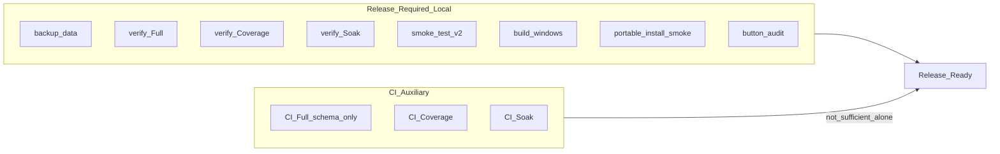
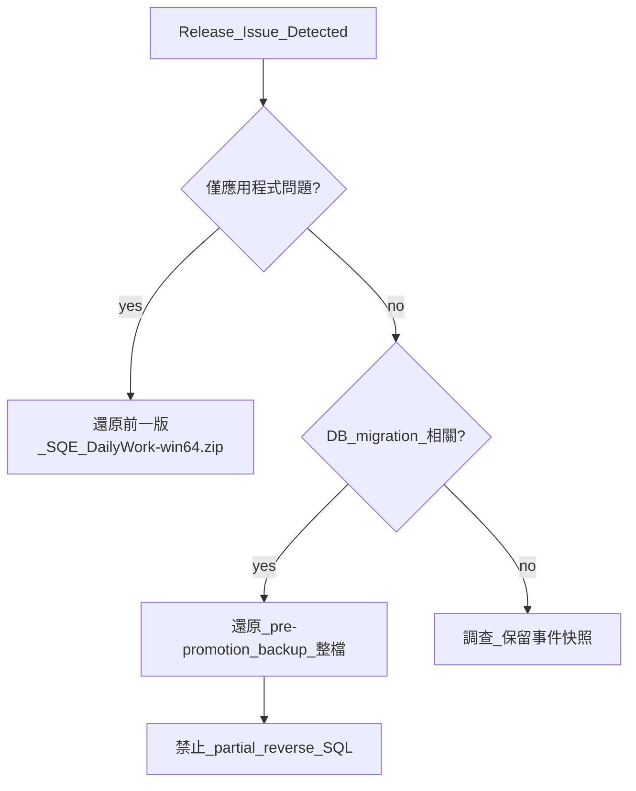

# SQE DailyWork Production Release Runbook

**適用：** unsigned portable onedir（`dist/SQE_DailyWork-win64.zip`）  
**版本基線：** 1.2.0+  
**重要：** CI green **不等於** production-ready。Release 必須完成下方本地 gate 全鏈。

---

## 0. 發布判定原則



| 層級 | 含義 |
|------|------|
| CI PASS | unittest + harness（schema-only、無 native visual）— **輔助證據** |
| Local Full PASS | 含 native visual belt + pixel baseline — **必要** |
| Artifact PASS | 新 build + portable smoke — **必要** |

---

## 1. 發布前檢查（Pre-flight）

### 1.1 工作區

- [ ] `git status` 乾淨或 release candidate 變更已 commit
- [ ] `docs/harness/source-baseline-manifest.md` live count 與 `git ls-files` 一致
- [ ] `scripts/harness_check.ps1` PASS（含 AGENTS.md size budget）

### 1.2 資料備份

```powershell
powershell -NoProfile -ExecutionPolicy Bypass -File scripts\backup_data.ps1
```

- [ ] 備份目錄：`data_backups/<timestamp>/`
- [ ] 確認無活躍 `SQE_DailyWork` / python 程序

### 1.3 Formal DB（僅當有新 migration 時）

**若所有 promotion 已套用（見稽核報告），跳過本節。**

標準作業（需使用者明示「繼續」）：

1. `sqlite_readonly_fingerprint.py --digest-only data\sqe_v2.db`（記錄 before）
2. 各 `apply_*_promotion.ps1` dry-run（**不加 `-Apply`**）
3. 使用者授權後：`-Apply` + post-verify
4. fingerprint after（業務列 parity）
5. 失敗 → 還原 pre-migration backup（**禁止 partial reverse SQL**）

| Promotion | 腳本 |
|-----------|------|
| case_actions_v1 | `migrate_case_actions_v1.py` / `verify_case_actions_phase1.ps1` |
| attachments | `apply_anomaly_attachments_promotion.ps1` |
| hypotheses | `apply_anomaly_hypotheses_promotion.ps1` |
| repeat_links | `apply_anomaly_repeat_links_promotion.ps1` |
| product_records VIEW | `apply_product_records_view_promotion.ps1` |

盤點狀態（read-only）：

```powershell
powershell -NoProfile -ExecutionPolicy Bypass -File scripts\audit_formal_db_promotion_status.ps1
```

或：

```powershell
$env:PYTHONPATH='src'
.venv\Scripts\python.exe scripts\audit_formal_db_promotion_status.py
```

---

## 2. 源碼驗證 Gate

### 2.1 Full verify（必要，本地 Windows + formal DB disposable）

```powershell
powershell -NoProfile -ExecutionPolicy Bypass -File scripts\verify.ps1 -Profile Full
```

**PASS：** exit 0 + `Full verification passed.` + formal DB fingerprint 不變  
**證據：** `scratch/verify-full-log-final.txt`  
**耗時：** 20–30+ 分鐘（背景執行）

### 2.2 Coverage

```powershell
powershell -NoProfile -ExecutionPolicy Bypass -File scripts\verify.ps1 -Profile Coverage
```

**PASS：** 完整鏈（compileall → 4-chunk → NCR → pytest → baseline → harness）+ `EXIT:0`  
**門檻：** line ≥ 71.0%（[`coverage-baseline.json`](coverage-baseline.json)）  
**證據：** `scratch/verify-coverage-*-final*.log`

> `assert_coverage_baseline.py` 單獨 PASS **不等於** Coverage Profile PASS。

### 2.3 Soak

```powershell
powershell -NoProfile -ExecutionPolicy Bypass -File scripts\verify.ps1 -Profile Soak
```

**PASS：** 10× MainWindow 導覽無例外 + harness_check  
**證據：** `scratch/verify-soak-final.log`

### 2.4 Release artifact gate（CI 補足）

```powershell
powershell -NoProfile -ExecutionPolicy Bypass -File scripts\verify.ps1 -Profile Release
powershell -NoProfile -ExecutionPolicy Bypass -File scripts\verify.ps1 -Profile Release -UseExistingDist
```

**PASS：** exit 0 + `scratch/release-gate-summary.json`；**不取代**本地 `-Profile Full` native visual gate。

### 2.5 Workflow smoke（建議；Release profile 已含）

```powershell
$env:PYTHONPATH='src;.'
$env:QT_QPA_PLATFORM='offscreen'
.venv\Scripts\python.exe scripts\smoke_test_v2.py
```

### 2.6 Button audit（建議；Release profile 已含）

```powershell
$env:PYTHONPATH='src;.'
$env:QT_QPA_PLATFORM='offscreen'
.venv\Scripts\python.exe scripts\button_audit_report.py
```

**PASS：** orchestrator exit 0、無 `orchestrator_status: FAILED`、無 SEH/unregistered pages

---

## 3. 產物建置 Gate

```powershell
powershell -NoProfile -ExecutionPolicy Bypass -File scripts\build_windows.ps1
powershell -NoProfile -ExecutionPolicy Bypass -File scripts\portable_install_smoke.ps1 -UseExistingDist
```

**PASS：**

- `dist/SQE_DailyWork/SQE_DailyWork.exe` 存在
- `dist/SQE_DailyWork/build-info.json` 含 version / git_commit / build_timestamp
- `dist/SQE_DailyWork-win64.zip` 存在
- frozen `--smoke-exit`：exit 0 + scratch DB 建立 + `logs/smoke_exit.ok` 非空

**記錄發布證據：**

```powershell
(Get-FileHash dist\SQE_DailyWork-win64.zip -Algorithm SHA256).Hash
Get-Content dist\SQE_DailyWork\build-info.json
```

---

## 4. 手動驗證（Major release 建議）

詳見 [`portable-install-checklist.md`](portable-install-checklist.md)：

- 非 repo 目錄解壓
- 路徑含空格 / 中文
- 標準使用者權限
- 既有 `data/` + `Outputs/` 遷移
- SmartScreen / AV 行為記錄

---

## 5. 回滾決策樹



| 情境 | 動作 |
|------|------|
| 應用程式 bug | 還原前一版 zip；DB 不動 |
| Migration 失敗 | 還原 `data_backups/` 或 `sqe_v2_backup_*` 整檔 |
| 部分 schema 問題 | **禁止** partial reverse SQL；整檔還原 |

Promotion 備份命名：`sqe_v2_backup_<phase>_<timestamp>.db`（見 risk-ledger）。

---

## 6. 不在本 runbook 範圍

- Authenticode 簽章（Phase 4 延後，見 [`phase4-signing-deferred.md`](phase4-signing-deferred.md)）
- Signed Inno installer（experimental only）
- 8 小時 soak（checklist-only；gate 為 10-cycle）
- Formal DB migration（無新 migration 時跳過）

---

## 7. 發布紀錄模板

| 欄位 | 值 |
|------|-----|
| 發布日期 | |
| 發布者 | |
| git commit | |
| zip SHA256 | |
| build-info.json | |
| Full verify log | |
| Coverage log | |
| Soak log | |
| portable smoke | pass / fail |
| SmartScreen 行為 | |
| Formal DB fingerprint | |

---

## 相關文件

- 缺口稽核報告：[`production-release-gap-audit-2026-08-29.md`](production-release-gap-audit-2026-08-29.md)
- Portable checklist：[`portable-install-checklist.md`](portable-install-checklist.md)
- Coverage baseline：[`coverage-baseline.json`](coverage-baseline.json)
- 風險登錄：[`docs/risk-ledger.md`](../risk-ledger.md)
